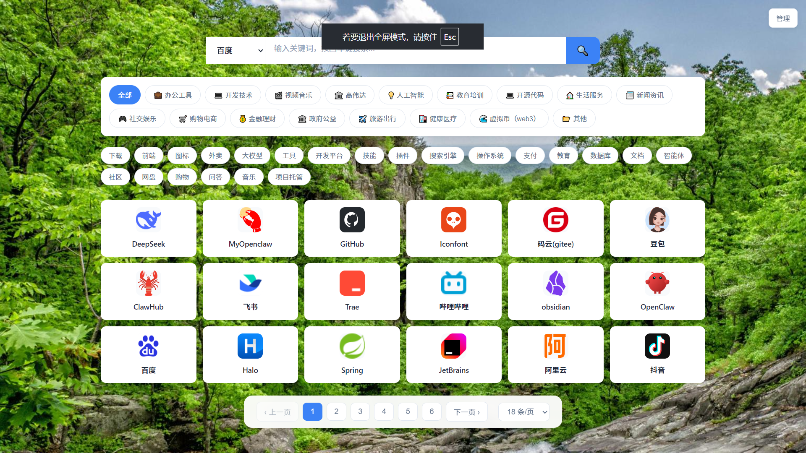

# Easy Web Tab

> 一个自托管的个人浏览器新标签页 / 工作台聚合应用。以「网址导航」为入口，叠加**个人工作台、学生工作台（含家长协同）、销售记账（摆摊进销存）、独立小游戏**四大模块，纯前端 SPA，数据默认全部存在你自己的浏览器里，可选 WebDAV 云同步。



---

## ✨ 功能特性

| 模块 | 路由 | 一句话说明 |
|------|------|-----------|
| 网址导航 | `/` · `/display` | 分类管理、全文搜索、多引擎切换、暗色模式、Markdown 导入导出 |
| 个人工作台 | `/workbench` | 待办 / 便签 / 日记 / 倒计时 / 番茄钟 / 习惯打卡 / 密码库 / 健康管理（运动·饮食·睡眠·体重）/ 记账，10 个面板 |
| 销售记账 | `/business` | 摆摊进销存：商品 / 进货 / 收摊 / 支出 / 库存 / 统计，盈亏与趋势分析 |
| 学生工作台 | `/student` | 习惯 / 作业 / 课表 / 计划 / 复习 / 错题 / 阅读 / 考试 / 教育经历 / 日记 / 番茄钟 / 成就 / 奖励 + 家长协同（PIN 锁） |
| 小游戏 | 菜单入口 | 孙子兵法、俄罗斯方块、小中高古诗、Cron 表达式生成器、号码生成器 |

- **隐私优先**：所有个人数据默认存于浏览器 `localStorage` / `IndexedDB`，不上传任何服务器；可选项开启 WebDAV（坚果云 / Nextcloud 等）做多设备云同步。
- **暗色模式 + 背景壁纸**：内置 30 张壁纸，可替换；主题随系统或手动切换。
- **纯逻辑可测**：核心计算（倒计时、记账、健康、学生各模块）抽成纯函数，配 `node --experimental-strip-types` 单测（`npm run test:*`）。
- **中文本地化**：UI 全中文；Element Plus 全量注册并挂 `zh-cn` 语言包。

---

## 🚀 快速开始

```bash
# 1. 安装依赖（仅首次）
npm install

# 2. 本地开发（热更新，端口 16718）
npm run dev
# 浏览器打开 http://localhost:16718

# 3. 生产构建（生成 dist/）
npm run build

# 4. 预览生产构建
npm run preview
```

> 默认端口固定为 **16718**，访问地址 http://localhost:16718
> 构建命令实际为三步走：`node scripts/generate-preset-icons.cjs`（扫描 public/icons 生成 presetIcons.ts）→ `vue-tsc -b`（类型检查）→ `vite build`。
> ⚠️ 在内存较小的机器上（< 2GB 可用内存）直接 `npm run build` 可能 OOM，用 `NODE_OPTIONS=--max-old-space-size=3072 npm run build` 即可。

### 一键启动（生产模式）

```bash
npm start          # 等价于 npm run build && npm run serve，启动后访问 http://localhost:16718
npm run serve      # 仅启动静态服务（读取已构建的 dist/，含游戏路由重写）
```

---

## 📄 页面与入口

| 页面 | 路由 | 说明 |
|------|------|------|
| 导航管理（后台） | `/` | 添加/编辑/删除网址，管理分类、搜索引擎、导入导出 |
| 导航展示（前台） | `/display` | 纯展示、隐藏管理按钮，适合设为浏览器新标签页 |
| 个人工作台 | `/workbench` | 待办 / 便签 / 日记 / 倒计时 / 番茄钟 / 习惯 / 密码 / 健康 / 记账 等 |
| 销售记账 | `/business` | 摆摊进销存：商品 / 进货 / 收摊 / 支出 / 库存 / 统计 |
| 学生工作台 | `/student` | 学习管理 + 家长协同 |

右上角按钮在「前台 / 后台」间切换；工作台与销售记账通过左侧菜单进入各自面板。

---

## 🖥️ 部署方式

### 方式一：双击运行（推荐个人使用）

直接双击根目录的 `run.bat` 即可启动（首次会自动安装依赖）。
> 前提：本机 `node` 已在系统 PATH 中（脚本不再写死 Node 路径）。

### 方式二：PM2 进程管理（推荐长期运行）

```bash
npm install -g pm2
pm2 start pm2.config.cjs          # 启动（内部用 serve 托管 dist/，端口 16718）
pm2 list / pm2 logs easywebtab    # 查看状态 / 日志
pm2 save                          # 保存，配合系统开机自启

# 开机自启（Windows，以管理员运行 PowerShell）
$taskAction = New-ScheduledTaskAction -Execute "powershell.exe" -Argument "-ExecutionPolicy Bypass -File `"$PWD\start-pm2.ps1`""
$taskTrigger = New-ScheduledTaskTrigger -AtLogOn
Register-ScheduledTask -TaskName "EasyWebTab-PM2" -Action $taskAction -Trigger $taskTrigger -RunLevel Highest

# 停止 / 重启
pm2 stop easywebtab
pm2 delete easywebtab
pm2 start pm2.config.cjs
```

### 方式三：Docker 容器

```bash
docker build -t easywebtab .                    # 构建镜像（serve -s 托管 dist/，端口 16718）
docker run -d -p 16718:16718 --name easywebtab easywebtab
docker logs easywebtab
```

### 方式四：Nginx 静态托管 + WebDAV 代理

用 Nginx 托管 `dist/` 时，页面本身纯静态，但**云同步（WebDAV）会撞浏览器跨域限制**，需要额外跑一个同源代理。

```bash
npm run build          # 产出 dist/
npm run webdav-proxy   # 启动 WebDAV 同源代理，默认 127.0.0.1:16719
# 或常驻：pm2 start scripts/webdav-proxy-only.cjs --name easy-webdav-proxy
```

Nginx 侧把 `/api/webdav-proxy` 反代到该进程：

```nginx
server {
  listen 443 ssl;
  server_name your-domain.com;

  root /var/www/easy-web-tab/dist;
  location / { try_files $uri $uri/ /index.html; }

  location /api/webdav-proxy {
    proxy_pass http://127.0.0.1:16719;
    proxy_set_header Host $host;
  }
}
```

代理协议：`POST /api/webdav-proxy`，请求头 `X-Webdav-Auth: Basic <base64(用户名:密码)>`，
body 为 `{ target, method, body? }`。用户凭据由前端运行时输入，代理进程不落盘、不记录。
监听地址与端口可用 `WEBDAV_PROXY_HOST` / `WEBDAV_PROXY_PORT` 覆盖；`GET /healthz` 可作健康检查。

> 开发环境不需要这个进程 —— `vite.config.js` 已内置同协议 dev proxy；`npm run serve` 启动的
> `scripts/serve-with-rewrites.cjs` 也已内置。

---

## 🧭 使用指南

### 键盘快捷键

| 快捷键 | 功能 |
|--------|------|
| `Ctrl+N` | 新增网址 |
| `Ctrl+B` | 切换前台 / 后台 |
| `Ctrl+D` | 切换暗色模式 |
| `Esc` | 关闭弹窗 |
| `Alt+K` | 全局搜索（Spotlight，跨待办/便签/倒计时/记账/密码/网址） |
| `Ctrl+Alt+1..9` | 跳转到工作台 / 销售记账的对应菜单项 |
| `g` | 在工作台与销售记账之间切换 |
| `[` / `]` | 在工作台 / 销售记账菜单模块间步进 |

### 网址导航

- **添加**：点击「+ 添加网址」或 `Ctrl+N` → 输入名称与地址 →「获取」自动拉取标题/描述/图标（经 Jina.ai，失败降级 allorigins 代理抓取 meta）→ 选分类、填标签 →「添加」。输入已存在网址会提示重复。
- **导入 / 导出**：设置（右上角 ⚙️）→「导航设置」→「站点管理」中上传 / 下载 `.md`（支持 YAML frontmatter），按 URL 去重，保留原有数据。
- **分类管理**：同区块「⚙️ 分类管理」增删自定义分类。
- **搜索引擎**：同区块「🔍 引擎管理」增删 / 设默认，搜索栏下拉切换。
- **断链检测**：同区块「断链检测」批量 HEAD/GET 校验书签可用性。
- **本地版本历史**：导航数据自动环形保留最近 10 版（`useBackup`，localStorage），可一键回滚。

### 个人工作台 `/workbench`

左侧菜单 10 项（均可改名 / 显示开关）：主页 · 待办 · 便签 · 日记本 · 倒计时 · 番茄钟 · 习惯打卡 · 密码 · 健康管理 · 记账。

- **主页**：问候条 + 三屏轮播（行动台 / 数据概览 / 工具），卡片可拖拽排序，6s 自动轮播。
- **待办**：自定义分类注册表、筛选 tabs、截止倒计时提示。
- **便签**：普通便签 + 时光轴双形态，分类筛选。
- **日记本**：每日一篇（本地日期唯一），Markdown 编辑 / 预览，历史卡片分页。
- **倒计时**：6 种重复规则（一次 / 每日 / 每周 / 每月 / 每年 / 间隔）+ 6 内置分类 + 自定义分类，5 种排序；到期三通道提醒（弹框 + 桌面通知 + 可选邮件摘要）。
- **番茄钟**：专注计时与统计。
- **习惯打卡**：左表单右卡片网格，连续打卡统计。
- **密码库**：crypto-js AES-CBC + PBKDF2 加密（纯前端，无需 HTTPS），主密码保护；支持导入 / 导出加密备份。
- **健康管理**：运动 / 饮食 / 睡眠 / 体重 四合一 tabs，目标计划 + 按天记录，BMI（国标 WS/T 428-2013）、达标率、趋势图；面板内嵌只读「定时提醒」区块。
- **记账**：六指标统计（收入 / 支出 / 结余 / 存款 / 笔数 / 支出比）+ 近 6 月收支趋势柱状图 + 支出分类占比环形图；金额默认掩码 `****`，可一键显隐；内置 8 分组不可删，支持计划自动复制。

### 销售记账（摆摊进销存）`/business`

布局复刻工作台，左侧固定 7 项：首页 · 商品 · 进货 · 收摊 · 支出 · 库存 · 统计。

- 商品 / 进货 / 收摊 / 支出全 CRUD，进货卡片按商品分类徽标、数量 × 单价自动合计。
- **库存** = 进货 − 带出 + 剩余，低库存阈值预警（默认 20，可配置），停售商品不参与。
- **统计**：营业额 / 成本（纯 COGS）/ 利润 / 毛利率 + 近 N 天趋势堆叠柱状图 + 分类 / 商品排行。
- 模块独立 JSON 备份（导入 / 导出，头部「📤 / 📥」）。

### 学生工作台 `/student`

独立页面，左侧菜单（学段 K/P/J 在首次引导 `StudentOnboarding` 强制选择）含：主页 · 习惯打卡 · 作业 · 课表 · 计划 · 复习 · 错题 · 阅读 · 考试 · 教育经历 · 日记 · 番茄钟 · 成就 · 奖励 · 家长协同。

- 14 个业务面板已统一为 Element Plus 组件（表单 / 弹框 / 表格 / 分页 / 滑块 / 颜色选择器等）。
- **成就系统**：内置 26 枚勋章（习惯连击 / 阅读 / 番茄 / 作业 / 复习 / 收集），自动解锁。
- **家长协同**（`StudentParent`）：6-tab（统计 / 每日任务 / 孩子报告 / 手动加分 / 发放勋章 / 配置奖励），`PIN` 锁（4–8 位，5 次错误锁 5 分钟），session 守卫在 `StudentView`。
- 学生数据走独立云同步信封，**不随工作台备份**。

### 小游戏

位于 `public/games/`，由 `manifest.json` 登记、经 `src/stores/sites.ts` 加载：

- 孙子兵法（`/games/sunzibingfa/`）
- 俄罗斯方块（`/games/tetris/`）
- 小中高古诗（`/games/gushi/`）
- Cron 表达式生成器（`/games/cron-generator/`）
- 号码生成器（`/games/id-generator/`）

> 小游戏是独立 HTML 应用；若用 `serve -s dist` 等无重写服务托管，相对资源可能 404，建议用 `npm run serve`（已内置游戏路由重写）。

### 云同步（WebDAV）

设置 →「云同步」填入 WebDAV 地址 / 账号 / 密码 / 同步间隔（配置**不进备份**）。同步走 5 文件信封：
`nav.json` / `icons.json` / `workbench.json` / `business.json` / `student.json`，
经同源代理 `/api/webdav-proxy`。冲突（本地脏 + 远端新 + diff > 500 字）弹出三选一（云端覆盖 / 本地覆盖 / 合并）。
触发时机：页面可见性变化 + 60s 轮询 + 手动。

### 数据备份与快照

- **工作台 JSON 备份**（`WORKBENCH_DATA_VERSION=9`，兼容 v1–v9）：导出 / 导入整库；v8 起内嵌密码加密身份（盐 + 验证串），跨设备导入后用原主密码解锁。
- **学生独立备份**（`student-backup` 信封，`STUDENT_DATA_VERSION=1`）。
- **快照（时光机）**：环形保留最近 10 份 IndexedDB 全量快照，可回滚。

### 备案信息

全站五页面底部居中自动显示备案页脚：ICP 备案号点击跳转工信部备案系统；公安联网备案号带徽标跳转公安备案查询平台。

配置方式（写死常量，无设置界面）：

1. 编辑 `src/config/beian.ts`：填入 `ICP_NUMBER` / `PSB_NUMBER`（空串 = 对应段不显示；两段都空 = 整个页脚不渲染）。
2. 公安徽标下载自全国互联网安全管理平台（`beian.mps.gov.cn`），放入 `public/beian/ghs.png`（`@error` 兜底隐藏）。
3. 重新构建部署（`npm run build`）后生效。

---

## 💾 数据存储

- **内置数据**：`public/data/sites.md`（默认初始网址，构建时复制进 `dist/`）；`public/data/myself-sites.md`（「下载示例数据」源，脱敏示例）。
- **用户数据（localStorage）**：`user-sites` / `user-categories` / `user-search-engines` / 主题 / 图标缓存 / 各类排序与分类偏好（如 `user-todo-categories`、`user-countdown-categories`、`password-verification-v2`）。用户数据优先级高于内置数据（同名 URL 覆盖）。
- **个人 / 业务 / 学生数据（IndexedDB）**：数据库名 `easy-web-tab`（当前 `DB_VERSION=12`），object store：
  - 9 核心：`todos` / `notes` / `diary` / `countdowns` / `passwords` / `health` / `ledger` / `settings` / `business`
  - 3 辅助：`pomodoro` / `habits` / `snapshots`
  - 1 图标：`icons`
  - 16 学生：`student_settings` / `student_habits` / `student_homework` / `student_timetable` / `student_plans` / `student_review` / `student_mistakes` / `student_reading` / `student_countdowns` / `student_education` / `student_diary` / `student_pomodoro` / `student_achievements` / `student_rewards` / `student_parent_tasks` / `student_images`

### 多浏览器 / 设备迁移

- **导航**：在「站点管理」点「导出」下载 `sites.md`，到另一浏览器「导入」。
- **工作台 / 学生**：在对应页面导出 JSON 备份，再到另一浏览器导入（v8+ 备份内嵌密码加密身份，用原主密码解锁）。
- **清除数据**：F12 → Application → IndexedDB 下删除 `easy-web-tab` 数据库；若 localStorage 仍残留旧快照（`user-countdowns` / `user-passwords`），需一并清除才干净。

---

## 🛠️ 开发指南（面向贡献者 / 智能体）

### 环境要求

- **Node.js**：>= 22.12（纯函数测试依赖 `node --experimental-strip-types`（Node ≥ 22.6），Vite 8 要求 ≥ 22.12）
- **包管理器**：npm（不依赖 pnpm / yarn / bun）
- **开发端口**：http://localhost:16718（配置于 `vite.config.js`）

### 核心依赖

| 依赖 | 用途 |
|------|------|
| `vue@3` | UI 框架 |
| `pinia@3` | 状态管理 |
| `vue-router@5` | 路由（5 个路由，全部 eager import） |
| `vite@8` | 构建工具 |
| `typescript@5` | 类型系统（strict + noUnusedLocals + noUnusedParameters） |
| `element-plus` | UI 组件库（**全量导入** + `zh-cn`，无需逐组件 import） |
| `echarts` + `vue-echarts` | 图表（记账趋势 / 占比 / 健康折线） |
| `crypto-js` | 密码库 AES-CBC + PBKDF2 加密 |
| `gray-matter` / `js-yaml` / `markdown-it` | Markdown / YAML 解析、日记渲染 |
| `metascraper*` | 网址元数据抓取兜底 |
| `@emailjs/browser` | 倒计时邮件提醒发送 |
| `@vueuse/core` | 组合式工具 |
| `playwright` | **运行时依赖**：元数据抓取走 headless 渲染兜底 |

### 常用命令

```bash
npm install          # 安装依赖（首次）
npm run dev          # 开发服务器（热更新）
npm run build        # generate-preset-icons → vue-tsc -b → vite build
npm run preview      # 预览生产构建
npm run serve        # 生产静态服务（含游戏重写）
npm run webdav-proxy # 独立 WebDAV 同源代理（16719）

# 纯函数单测（node --experimental-strip-types）
npm run test:countdown   # countdownCore.ts
npm run test:reminder    # reminderCore.ts（邮件配置/决策/模板）
npm run test:todo        # todoCore.ts
npm run test:health      # healthCore.ts（BMI/达标率/睡眠/折线）
npm run test:ledger      # ledgerCore.ts（月统计/占比/自动复制）
npm run test:notes       # noteCore.ts
npm run test:diary       # diaryCore.ts
npm run test:note-markdown
npm run test:menu        # workbenchMenuCore.ts
npm run test:paging      # panelPagingCore.ts
npm run test:business    # businessCore.ts（库存/成本/趋势坐标）
npm run test:habits
npm run test:pomodoro
npm run test:spotlight
npm run test:snapshot
npm run test:student     # 聚合 14 个 test:student-*（需 --experimental-loader）

# UI 验证
npm run qa:student-ui    # 学生工作台 Playwright UI QA
```

> 无 vitest / jest；纯逻辑测试直接 `node --experimental-strip-types`。学生 cores 用无扩展名相对导入（`./countdownCore`），测试必须带 `--experimental-loader ./scripts/resolve-extensionless.mjs`（已封装在 `npm run test:student`）。

### 项目结构

```
easy-web-tab/
├── src/
│   ├── components/               # 22 个根 SFC（导航/设置/搜索/Spotlight/备案页脚/图标等）
│   │   ├── workbench/            # 20 个个人工作台面板 SFC
│   │   ├── student/              # 19 个学生工作台面板 SFC
│   │   └── business/             # 8 个销售记账面板 SFC
│   ├── composables/              # 53 个组合式（含 useIdb / useCloudSync / useBackup /
│   │   │                         #   useSnapshots / useHomeLayout / useHomeStats / useWeather /
│   │   │                         #   spotlightCore + 各 *Core 纯逻辑 + 1 个自动生成的 presetIcons.ts）
│   ├── stores/                   # 31 个 Pinia store（16 工作台/业务 + 15 学生）
│   ├── views/                    # 5 个视图：Home / Display / Workbench / Business / Student
│   ├── router/index.ts           # / /display /workbench /business /student（eager）
│   ├── config/beian.ts           # 备案页脚常量
│   ├── types/index.ts            # 全部 TS 接口（含 WORKBENCH_DATA_VERSION=9 / STUDENT_DATA_VERSION=1）
│   └── styles/                   # dark.css / background.css
├── public/
│   ├── data/sites.md             # 默认初始网址
│   ├── data/myself-sites.md      # 示例数据下载源
│   ├── icons/                    # 预置品牌 svg（构建时扫描）→ presetIcons.ts
│   ├── backgrounds/              # 壁纸（30 张）
│   ├── beian/ghs.png             # 公安备案徽标
│   └── games/                    # 5 个小游戏 + manifest.json
├── scripts/                      # 构建/服务脚本 + 纯函数测试 + WebDAV 代理
│   ├── generate-preset-icons.cjs # 构建第一步，扫描 public/icons → presetIcons.ts
│   ├── serve-with-rewrites.cjs   # npm run serve 生产服务器（游戏重写 + WebDAV 代理）
│   ├── webdav-proxy-only.cjs     # 独立 WebDAV 同源代理
│   └── resolve-extensionless.mjs # 学生测试 loader
├── server.cjs / pm2.config.cjs   # PM2 路径（serve -s dist，端口 16718）
├── Dockerfile                    # serve -s，端口 16718
├── run.bat / start-pm2.ps1       # Windows 启动脚本（不再写死机器路径）
├── vite.config.js                # 真实 Vite 配置（@ → /src + WebDAV dev proxy，端口 16718）
├── index.html
├── package.json
└── README.md
```

### 关键约定

- **一律 `<script setup lang="ts">`**；领域状态用 Pinia store；纯逻辑复用放 `composables/*Core.ts`；组件内**禁止重算**纯函数（达标率 / 趋势坐标 / 分页行数等统一走 core）。
- **路径别名 `@` → `/src`**，用 `@/` 而非相对 `../`。
- **`presetIcons.ts` 自动生成**：不要手写，改 `scripts/generate-preset-icons.cjs` 或往 `public/icons/` 加文件。
- **IndexedDB 写入前必须 `toRaw()`**（结构化克隆无法处理 Vue reactive Proxy，否则 `DataCloneError`）；嵌套 reactive 数组需逐数组 `toRaw`。
- **Element Plus 全量导入**：各面板直接用 `<el-table>` / `<el-pagination>` 等，无需 import。
- **无 ESLint / Prettier**：代码质量仅靠 TypeScript strict 模式。
- **提交信息**：中文、前缀 `fix-` / `feat-`（如 `fix-导出不导出默认引擎`）。

### 常见修改场景

- **加新页面**：`src/views/` 建 `.vue` → 在 `src/router/index.ts` 注册（eager import）。
- **加全局状态**：`src/stores/` 建 store → 用 `useXxxStore()`。
- **改数据模型**：改 `src/types/index.ts` 接口 → 同步 `stores/` 使用处。
- **改内置预置图标**：编辑 `scripts/generate-preset-icons.cjs` 或往 `public/icons/` 放 svg，重新 `npm run build`。
- **改内置初始网址**：编辑 `public/data/sites.md`（构建进包）。

---

## 🔒 隐私与开源说明

- **无硬编码密钥**：仓库不含任何 API key、密码、WebDAV 账号；云同步凭据全部由用户运行时输入。
- **数据自托管**：默认所有个人数据存于你自己的浏览器，可选自托管 WebDAV 同步。
- **License**：[MIT](./LICENSE)。可自由用于个人 / 商用，保留版权声明即可。

---

## ⚠️ 已知事项

- 内壁纸 `public/backgrounds/`（30 张，约 7.4 MB）来源授权需自行确认，开源分发前请替换为有授权的图片。
- `npm run serve`（`serve-with-rewrites.cjs`）内置游戏重写；`gushi` / `szbf` 等游戏若用其它静态服务托管，相对资源可能 404。
- 备份版本号：IndexedDB `DB_VERSION=12`；工作台备份 `WORKBENCH_DATA_VERSION=9`；学生备份 `STUDENT_DATA_VERSION=1`。改版本号需同步 `useIdb.ts` 导入守卫与迁移分支。
